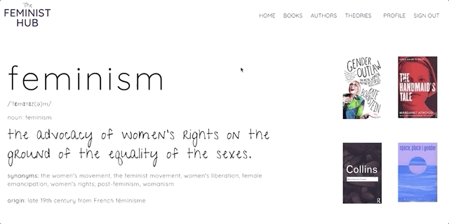
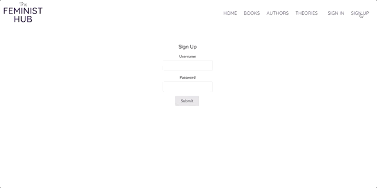
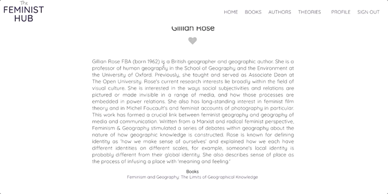
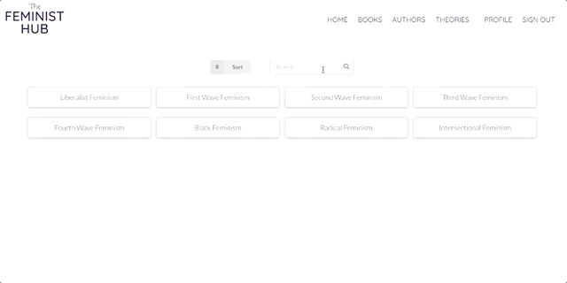
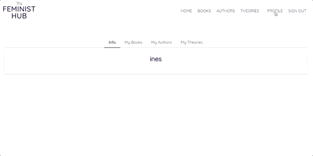

# The Feminist Hub

### [Live site](thefeministhub.net) (username: ines / password: ines)

### [Demo](https://youtu.be/AigI6MtiBjo)

### [BackEnd](https://github.com/inesgs12/feminist-website-backend)

## About

The goal is that the Feminist Hub becomes your go-to page for all things feminist - where you can learn about feminism and join a community of like-minded people.

This website is the result of 15 weeks of learning at Flatiron School's Immersive Software Engineering Bootcamp. At the moment, I seeded some feminist books, authors and theories for the final showcase. This is just the starting point, I will keep adding as time goes by.

## Technology

This app was built with Rails in the backend and React in the frontend. The design was created using a combination of CSS and UI frameworks.

At the moment, it's **not** mobile-friendly but **I intend to built it using React Native shortly**. I'm very proud of the outcome considering we had two weeks to come up with the idea.

- Ruby on Rails
- React.JS
- HTML / CSS / Semantic UI
- OAuth / bcrypt / JWS
- PostgreSQL

## Features

Users can sign up to the add and then sign in to browse books, authors and theories.

Users can browse through books, sort them alphabetically or throught the author's name. Users can search for books or authors.

Users can go to the author's page through the books page.

Users can search through different femininst theories and add them to their favourites.

... and then see all of their favourites in their profile

They can leave reviews (full CRUD) for each book, buy the book on Amazon, and also follow a link to the book's author's page.

